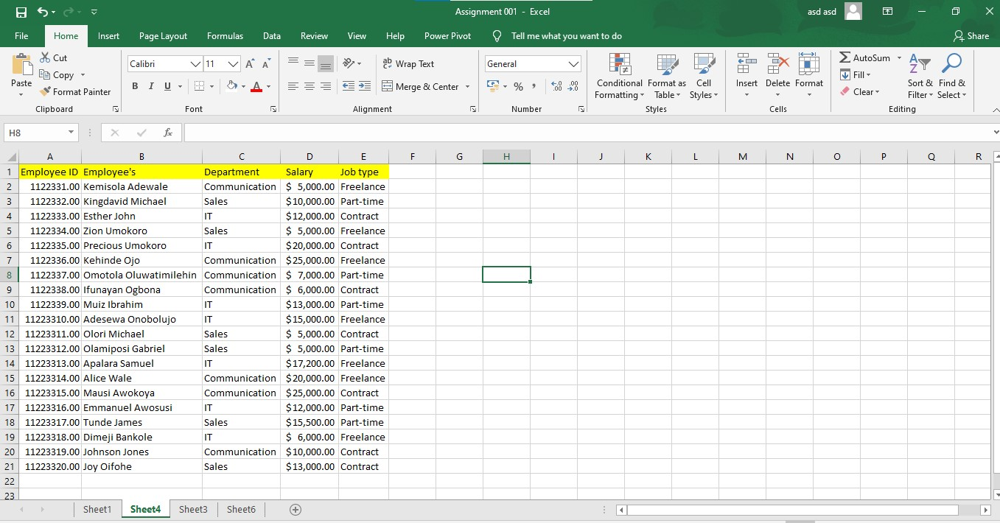
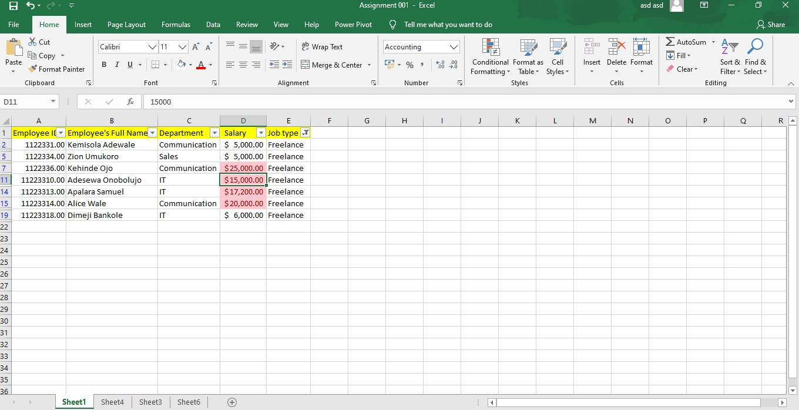
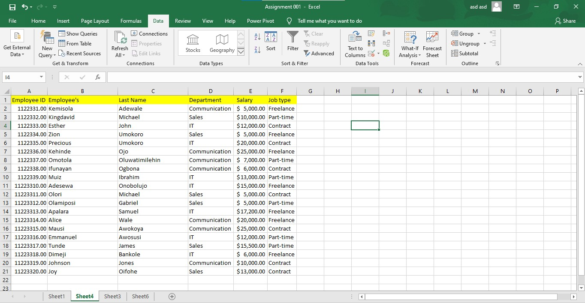
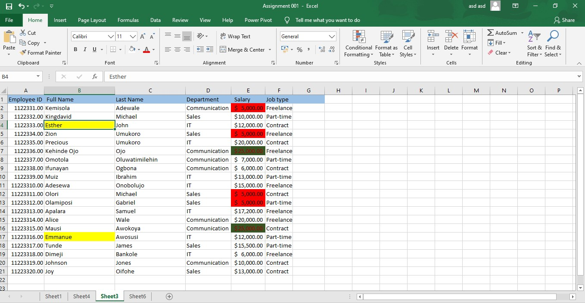
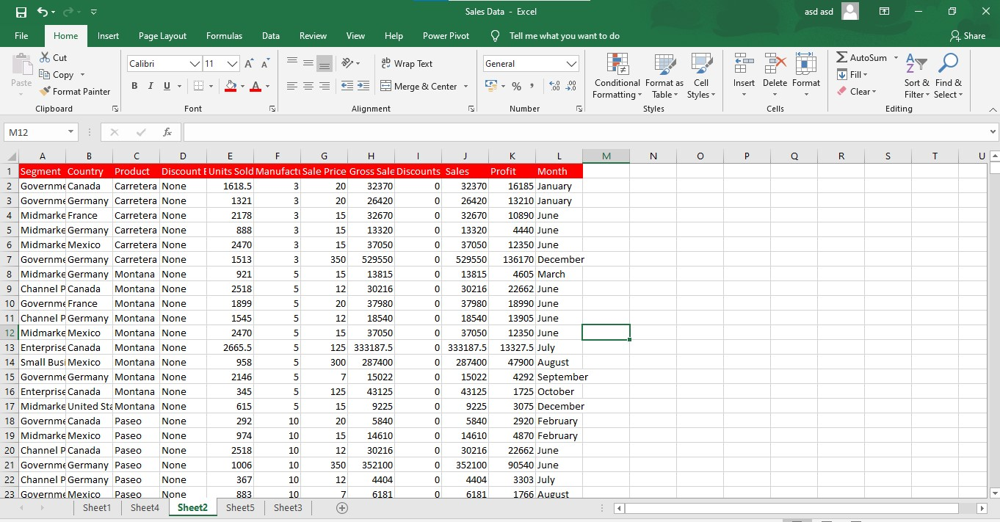
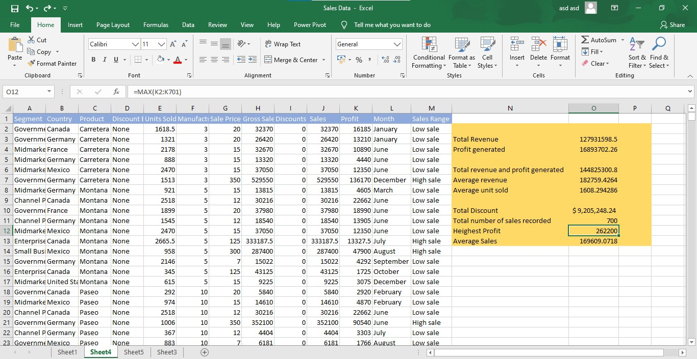
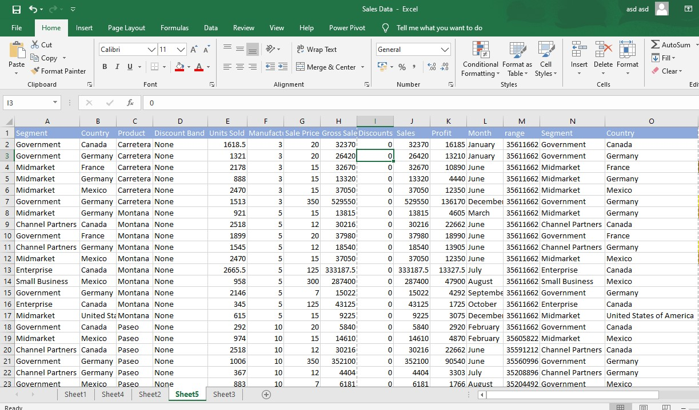
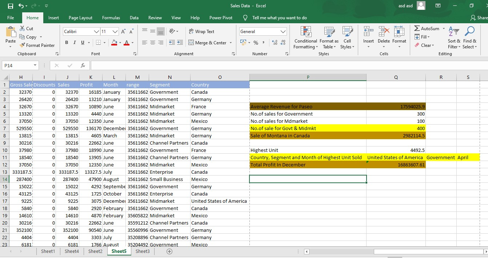

# Victory
Data_Analysis_ Cohort3_Task1
# Introduction
According to the course requirement in the data analysis cohort 3, 2023  which Promise Chinoso is handling, I was required of me to create a table list of imaginary company employees with the under-listed features: 
-Employees’ ID
-Employees’ Full Name
-Department
-Salary
-Job type
# Students Activities
Show the following from the table generated:
1. Employees who are working as freelancers and earning above $10,000.
2. Split the employees' full names into first names and last names, highlighting any form of duplicate value in the table.
3. Highlight employees whose names start with E in yellow color, and highlight the highest salary value in green and the lowest salary value in red.
# Skills Involved
1. Analytical skills
2. Data Manipulation Skills
3. Use of Filter Function n
4. Use of Delimiter Function
5. Use of Conditional Formatting skills
# Data Set

As regards the first activity, I added a filter function to the employees’ table and filtered the job type column to Freelancer only. Among the freelancers, I had to highlight in red those whose salaries were above the threshold of  $10000 as shown below.

Also for the next activity, I split the employees’ full names into first and last name columns using the Delimiter function on the data tool Excel ribbon. After this, I checked for duplicate using the duplicate function and fortunately, there was none as revealed by the table below.

Lastly on the task, to highlight the employees whose names began with the letter “E”, I used the filter function again to filter to only the employees whose names are thus described above and highlighted them using the yellow ink as displayed below.

Summarily, we can see that of the seven(7) Freelancing employees, three of the earned below the threshold of $10000. Also only two employees’ have they began with the letter “E”. Lastly contract and Freelancing employees’ earned the highest salary of $25000.
In conclusion, I want to recommend that the salary of the part-time staff be reviewed to match that of other staff in the company.

# TASK 2
The second task carrying out a business analysis of the sales report of an imaginary company. The following problems were to be resolved using the data set:
-	The total revenue and profit generated.
-	The average revenue and units sold for every order.
-	The total discount given is $.
-	The total number of sales recorded.
-	The highest profit generated.
-	Create a column named ‘sales range’, and return High Sales’ if the sales value is above average, otherwise. Return ’Low Sales.
	# Skills Involved
1. Use of SUM
2. Use of AVERAGE
3. Use of COUNT
4. Use of MAX
# A View of The Data Set

 # Analysis of the Problem

First of all, cleansed the data of any duplicate and empty spaces using the Remove Duplicate Function.
And for the average revenue and units sold for every order, the Average Function came in handy. So I got the average Gross Sales and Unit Sold using the Average Function.
Also, I got Calculated the Total  Discount given in dollars ($) using the Sum Function to add up the Discount Column. 
Again to get the Total number of Sales recorded, I used the Count Function to count the  Sales Column.
And for the highest Profit generated, the Max Function was used to obtain that.
Lastly, I added a column named ‘Sales Ranges’ by inserting a new column and using the IF Function, I returned the sales whose value were above the average sales value as ‘High Sales’ and those that were below the Average Sales value were returned as ‘Low Sales’.
# Discussion of Findings
 Summarily, it can be seen that the Total Revenue Generated  from the Sales report is $127931598.5, while a total of $16893702.26 was realized as Profit. The average revenue  and unit sold stood  at $182759.4264 and $ 1608.294286 respectively. A total discount of $ $ 9,205,248.24 was given haven recorded 700 sales with a peak profit of $262200.

 # TASK 3
Using the same Sales Data as in Task 2 above, Calculate:
-	The average revenue generated from each sale of ‘Paseo’
-	The number of sales made in the Government and Midmarket segment.
-	The total revenue generated from the sales of ‘Montana’ in Canada.
-	In which Country, Segment, and Month was the highest unit of goods sold?
-	What is the total profit made in December?
  # A view of the Data Set 
  

 # Skills Involved
 1. Use of AVERAGE
 2. Use of COUNTIF
 3. Use of SUM
 4. Use of SUMIF
 5. Use of MAX
 6. Use of VLOOKUP
 
  # Analysis of the Problem
  
To get the average revenue generated from each sale of ‘Paseo’, I applied a filter to the table, and on the Product column, I filtered to only Paseo and used the Average function to get the value from the Gross sales column.
Also, I calculated the number of sales made in the Government and Midmarket segments by using the COUNTIF Function for each of them separately and added their values afterward.
Again I obtained the total revenue generated from the sales of ‘Montana’ in Canada alone By using the SUMIFS Function. 
I was able to get the Country, Segment, and Month in which the highest unit of goods  was sold using the VLOOKUP Functions to check for the highest unit sold value in the Country, Segment, and Month columns respectively. 
Lastly, I got the total profit made in December by first applying the filter to the table, and on the Month column, I filtered to only December. After this, I used the SUM Function to add up the Profit made in December.
Summarily, the average revenue of $ 17594025.9 was realized from each sale of ‘Paseo’. A total of 400 sales were recorded  from Government and Midmarket Segments. In Canada, the revenue generated from the sales of Montana stood at $2982114.5. In the United States of America, we had the highest number of units sold by the Government in April. In December we made a total profit of $ 16863607.61.
# Recommendation
Based on the analysis above, I want to recommend that :
The market in US market should be our number priority  purchased more of our products.
More goods should be produced in April since there is a high demand during that period.
More Montana goods should be made available to the Canadian market while making an effort to strengthen the sales of other products there as well.
The market forces of other Countries should be keenly studied to enhance sales in these poor sales Countries. 

